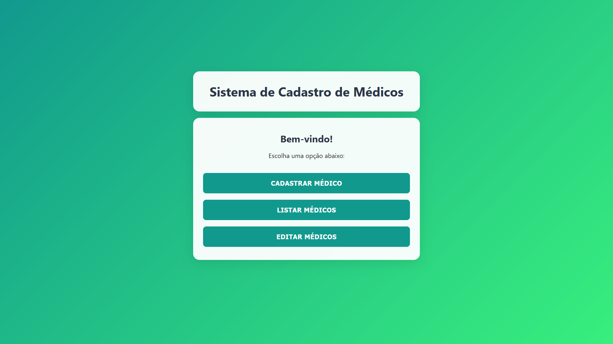
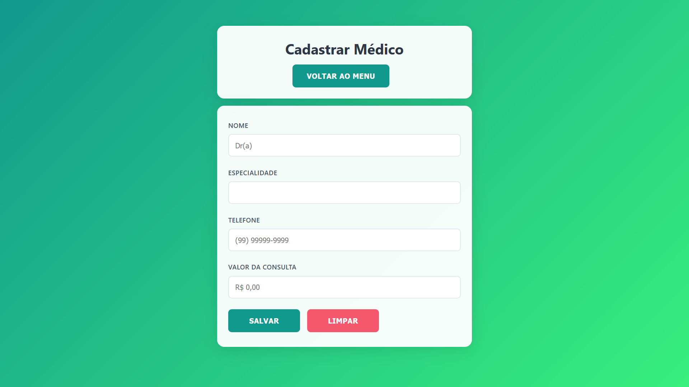
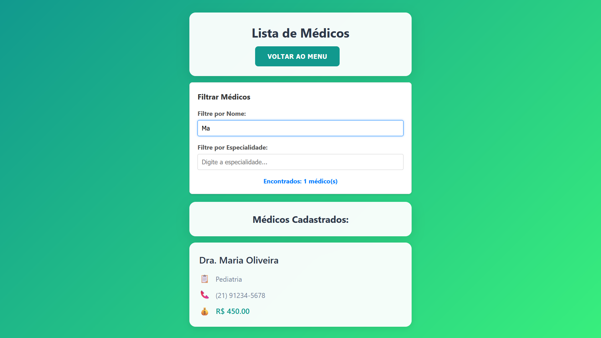
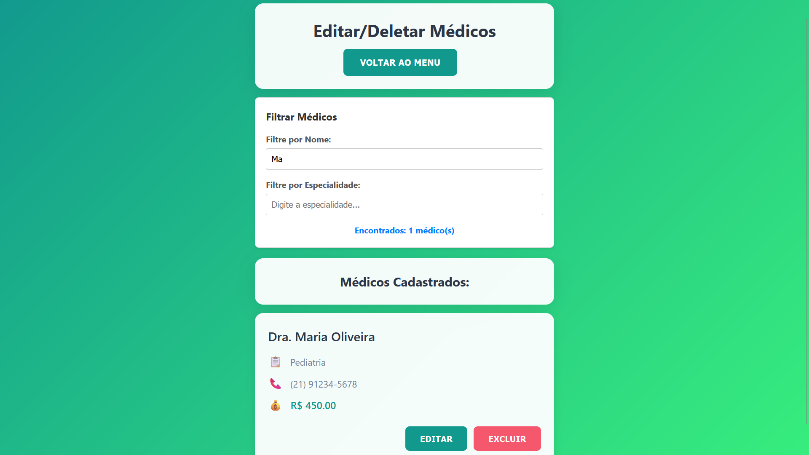
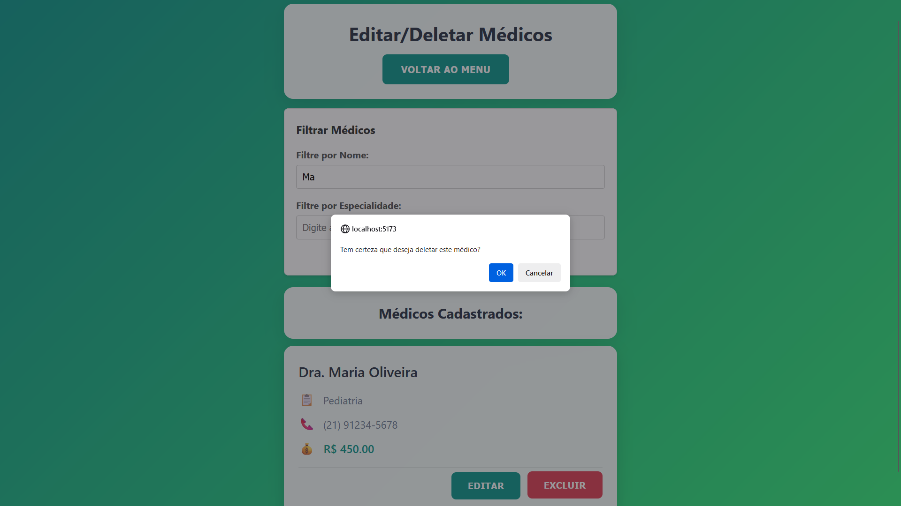
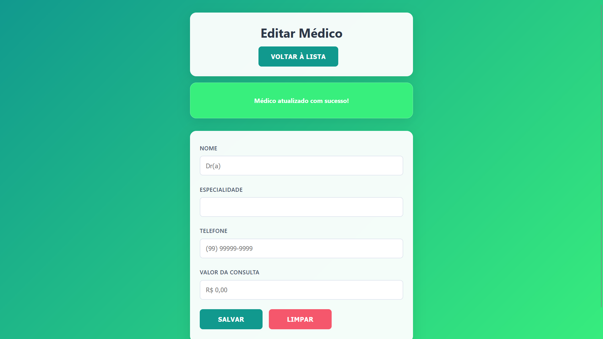
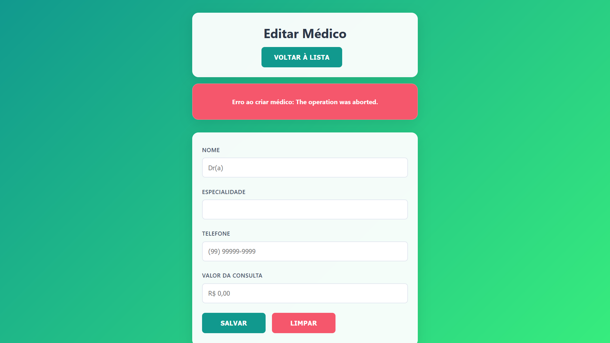

# Sistema de Cadastro de Médicos - React

## 📋 Sistema de Cadastro de Médicos

Aplicação web para gerenciamento completo de cadastro de médicos, permitindo criar, listar, filtrar/pesquisar, editar e excluir registros de profissionais de saúde.

---

## 🎯 Objetivo do Projeto

Esse sistema foi desenvolvido para a disciplina de Desenvolvimento de Aplicações Interativas com React. Ele permite o gerenciamento de cadastros médicos, permitindo que clínicas e consultórios mantenham um registro organizado de seus profissionais de saúde. A aplicação oferece uma interface para:

- Cadastrar novos médicos com informações completas (nome, especialidade, telefone e valor da consulta)
- Visualizar a lista completa de médicos cadastrados
- Filtrar médicos por nome e especialidade
- Editar informações de médicos existentes
- Remover médicos do sistema
- Navegação entre páginas para cada funcionalidade (cadastrar, editar e listar médicos existentes.)
- Integração com banco de dados JSON através de API REST (Para fins da disciplina a API foi mockada utilizando json-server).

**OBSERVAÇÃO**: Conforme permitido pelo professor, toda a estilização `CSS` foi feita com auxílio de inteligência artificial.

O problema que resolve: **Centralizar e organizar o cadastro de profissionais médicos, eliminando a necessidade de planilhas ou registros em papel, facilitando consultas rápidas e atualizações em tempo real.**

---

## ✨ Features Implementadas

### 1. **Navegação por Páginas usando biblioteca React Router**
   - Menu principal com navegação para diferentes funcionalidades através de botões interativos exibidos na tela.
   - Funcionalidades configuradas: Home Page, Página de cadastro, página de edição e página de listagem de médicos.
   - Página exibindo erro 404 para rotas não encontradas

### 2. **Cadastro de Médicos**
   - Formulário para inserção de dados do médico
   - Campos: Nome completo, Especialidade, Telefone e Valor da Consulta
   - Validação de campos obrigatórios
   - Formatação automática de telefone (DDD + número)
   - Formatação de valor monetário
   - Exibição na tela de mensagem de feedback da operação realizada (sucesso ou erro)
   - Possibilidade de inserir novo médico sem mudar de página, bastando iniciar novamente o preenchimento do formulário

### 3. **Listagem de Médicos**
   - Página dedicada para visualização de médicos cadastrados
   - Possibilidade de filtra (pesquisar) os médicos exibidos por nome, por expecialidade e por ambos.
   - Exibição de todos os médicos cadastrados
   - Visualização de todas as informações de cada profissional

### 4. **Filtro de Médicos**
   - Componente `FiltroMedicos` implementado
   - Filtro por nome, especialidade ou ambos em tempo real
   - Contador de médicos encontrados
   - Utilizado nas páginas de Listar e Editar médicos

### 5. **Edição de Médicos**
   - Página dedicada para editar/deletar médicos cadastrados
   - Seleção de médico existente para edição
   - Componente de filtro para encontrar médicos rapidamente

### 6. **Exclusão de Médicos**
   - Confirmação antes de deletar
   - Remoção de registros de médicos
   - Atualização imediata da listagem

### 7. **Integração com API REST**
   - Controller dedicado para operações CRUD em API hospedada em [(http://localhost:3000/)]
   - Comunicação com API mockada utilizando JSON Server
   - Métodos implementados: Create, Read, Update, Delete
   - Tratamento de erros e respostas assíncronas
   - AbortController e Singal para timeout de requisições e race condition

### 8. **Validações e Formatações**
   - Validação de telefone com 11 dígitos (DDD + número)
   - Formatação visual: (XX) XXXXX-XXXX
   - Validação de valor de consulta (apenas números)
   - Formatação monetária: R$ XXX,XX
   - Validação de campos obrigatórios
   - Capitalização automática de nomes

### 9. **Gerenciamento de Estado**
   - Controle de estado com React Hooks (useState, useEffect)
   - Sincronização entre formulário e lista
   - useParams para capturar ID da URL

### 10. **Arquitetura Modular**
   - Páginas organizadas em pastas individuais com CSS próprio
   - Componentes reutilizáveis (FiltroMedicos, ListMedicos, AddForm)
   - Separação de responsabilidades

---

## 🛠️ Tecnologias Utilizadas

### **Frontend**
- **React 19.2.0** - Biblioteca JavaScript para construção de interfaces
- **React Router DOM 7.9.6** - Biblioteca para navegação entre páginas
- **Vite 7.2.2** - Build tool
- **JavaScript** - Linguagem de programação
- **CSS** - Estilização e layout

### **Backend/API**
- **JSON Server** - API REST mockada para desenvolvimento

### **Estrutura do Projeto**
```
src/
├── App.jsx                   # Configuração de rotas do site
├── main.jsx                  # Função principal que renderiza o SPA
├── controller/
│   ├── controller.jsx        # Lógica de comunicação com API
├── components/
│   ├── screen/
│   │   ├── form.jsx          # Componente de formulário de cadastro/edição
│   │   └── list.jsx          # Componente de listagem
│   └── FiltroMedicos/
│       ├── FiltroMedicos.jsx # Componente de filtro reutilizável
│       └── FiltroMedicos.css
└── pages/
    ├── HomePage/
    │   ├── HomePage.jsx      # Página inicial com menu
    │   └── HomePage.css
    ├── CadastrarPage/
    │   ├── CadastrarPage.jsx # Página de cadastro/edição
    │   └── CadastrarPage.css
    ├── ListarPage/
    │   ├── ListarPage.jsx    # Página de listagem (somente visualização)
    │   └── ListarPage.css
    ├── EditarPage/
    │   ├── EditarPage.jsx    # Página de edição com ações
    │   └── EditarPage.css
    └── NotFoundPage/
        ├── NotFoundPage.jsx  # Página 404
        └── NotFoundPage.css
```

---

## 🚀 Instruções de Execução

### **Pré-requisitos**
- Node.js (versão 22 ou superior)
- npm (gerenciador de pacotes do Node.js)

### **Passo 1: Clone o Repositório**
```bash
git clone https://github.com/paulosigiani/CadastroMedicoReactInfnet
cd CadastroMedicoReactInfnet
```

### **Passo 2: Instale as Dependências**
```bash
npm install
```

### **Passo 3: Configure o JSON Server**
O projeto já possui um arquivo `db.json` com dados de exemplo. Certifique-se de que ele está na raiz do projeto.

### **Passo 4: Inicie o JSON Server**
Em um terminal, execute:
```bash
json-server db.json --port 3000
```

O servidor da API estará rodando em `http://localhost:3000`

**Importante**: Verifique o endereço configurado no arquivo `src/controller.jsx` e ajuste se necessário na linha:
```javascript
const base = "http://localhost:3000/medicos";
```

### **Passo 5: Inicie a Aplicação React**
Em outro terminal, execute:
```bash
npm run dev
```

A aplicação estará disponível em `http://localhost:5173`

---

## 🔗 Link do Repositório GitHub

[https://github.com/paulosigiani/CadastroMedicoReactInfnet](https://github.com/paulosigiani/CadastroMedicoReactInfnet)

---

## 📸 Screenshots ou Demonstração

### Tela Inicial

*Interface para cadastro de novos médicos com validações em tempo real*

### Formulário de Cadastro

*Interface para cadastro de novos médicos com validações em tempo real*

### Listagem de Médicos Cadastrados

*Cards organizados exibindo todos os médicos cadastrados*

### Pagina de seleção para Edição

*Cards organizados exibindo todos os médicos cadastrados com opções de editar e excluir*

### Formulário de Edição

*Formulário preenchido automaticamente com dados do médico selecionado para edição*

### Mensagem de confirmação de remoção de registro

*Mensagem para confirmar deleção de registro*

### Mensagem de sucesso de cadastro


### Mensagem de erro de cadastro


---

## 💭 Considerações Finais

### **Processo de Desenvolvimento**

O desenvolvimento deste projeto foi uma jornada de aprendizado significativa, onde pude aplicar conceitos modernos do React e boas práticas de desenvolvimento web. A evolução do projeto passou por diferentes fases:

1. **Fase Inicial com CRUD na tela**: Implementação do CRUD totalmente no frontend
2. **Fase de Integração com API Externa**: Migração para arquitetura com API REST usando JSON Server
3. **Fase de criação de rotas**: Separação das funcionalidades em diferentes páginas
4. **Fase de Refinamento**: Implementação de validações, formatações e melhorias visuais

O projeto iniciou com a construção de uma aplicação simples de CRUD com persistência na própria tela, progredino para integração e persistência em API simulada com json-server, terminando numa aplicação modularizada com navegação entre páginas. Aprendi a utilizar props, hooks useState e useEffect, funções async, integração com API, controle de timeout, race condition e React Router.

A experiência prática adquirida neste projeto será fundamental para o desenvolvimento de aplicações React mais complexas e profissionais no futuro.

### **Desafios Enfrentados**

1. **Gerenciamento de Estado**: Um dos principais desafios foi sincronizar o estado entre o formulário e a lista durante as operações de edição. A solução foi usar `useEffect` e `useState` para monitorar mudanças no médico em edição.

2. **Navegação com React Router**: Implementar navegação entre páginas. Uso de `useParams` para capturar IDs da URL.
   
3. **Componentização e Reutilização**: Criar componentes reutilizáveis que funcionassem em diferentes páginas
   
4. **Validações em Tempo Real**: Implementar formatações de telefone e valor monetário durante a digitação no formulário, que foi solucionado usando funções do tipo handle.

5. **Comunicação Assíncrona**: Trabalhar com Promises e async/await para integração com a API, incluindo tratamento de erros e timeouts.

### **Aprendizados Adquiridos**

- **React Hooks**: Domínio de `useState`, `useEffect`
- **React Router**: Configuração de rotas, parâmetros de URL
- **Programação Assíncrona**: Promises, async/await e como lidar com operações assíncronas no JavaScript para comunicação com APIs
- **Componentização**: Importância de dividir a aplicação em componentes reutilizáveis e com responsabilidades bem definidas
- **Controle de Requisições**: Uso de `AbortController` para cancelar requisições e evitar race conditions

### **Reflexão Final**

Este projeto foi relevante para consolidar meus conhecimentos em desenvolvimento frontend utilizando React e suas principais ferramentas. A evolução do projeto de um CRUD simples para aplicação com múltiplas páginas e componentes reutilizáveis que persiste dados em API mostrou como aplicações reais funcionam.

---

## 🙏 Créditos

- **Desenvolvedor**: Paulo Palmuti Sigiani Neto
- **Instituição**: Instituto Infnet
- **Disciplina**: Desenvolvimento de Aplicações Interativas com React
- **Professor**: Willian Almeida Rodrigues
- **Ano**: 2025


### **Recursos Utilizados**
- [Documentação Oficial do React](https://react.dev/)
- [Documentação do Vite](https://vitejs.dev/)
- [JSON Server GitHub](https://github.com/typicode/json-server)
- [React Router DOM](https://reactrouter.com/)
- Inteligência artificial para geração de CSS e saneio de dúvidas:
  - [ChatGPT](https://chatgpt.com/)
  - [Microsoft Copilot](https://copilot.microsoft.com)
- Comunidade StackOVerflow para pesquisa e dúvidas:
  - [Stack OverFlow](https://stackoverflow.com/)